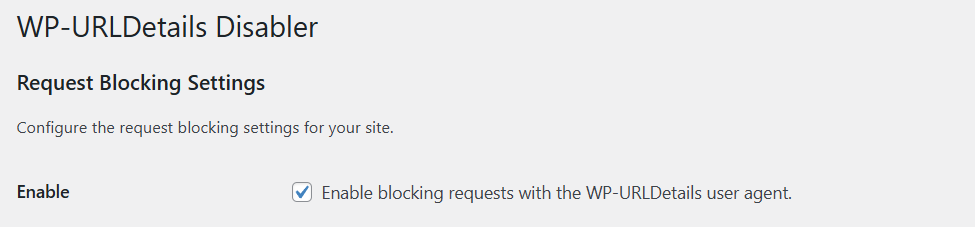

# WP-URLDetails Disabler

This plugin disables any requests from your WordPress site containing `WP-URLDetails` in the user-agent string. You may
find it useful if you don't want to leak your server's IP address to other servers.

## Installation

1. Download the plugin from the [GitHub repository](https://github.com/MrBoombastic/wp-urldetails-disabler). Use
   "Download as ZIP" feature or whatever.
2. Upload the plugin files to the `/wp-content/plugins/wp-urldetails-disabler` directory, or install the plugin through
   the WordPress GUI directly.
3. Activate the plugin through the 'Plugins' screen in WordPress.
4. Go to 'Settings' → 'Block WP-URLDetails' to configure the plugin.

## Usage

1. Navigate to the plugin settings page.
2. Tick the checkbox.

## License

This plugin is licensed under the WTFPL. For more information, see the [license file](LICENSE.md).
