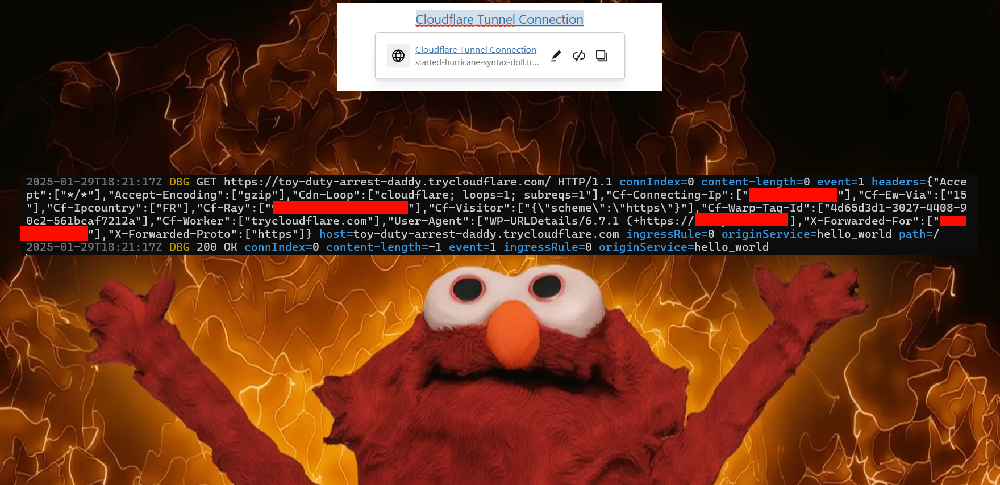
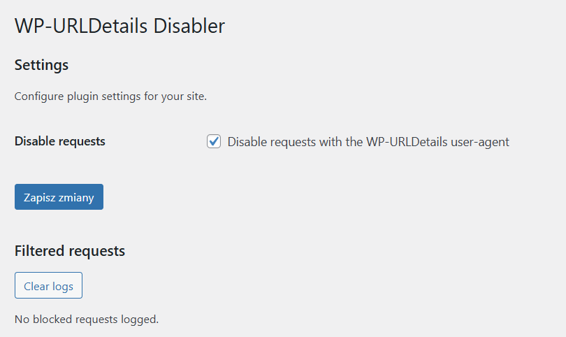
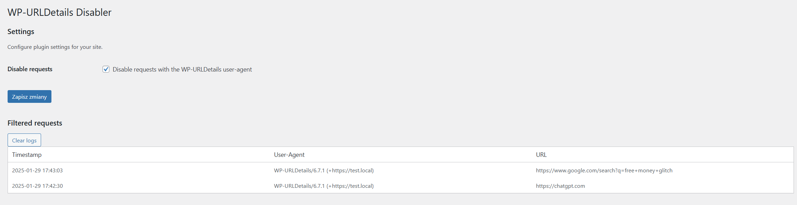

# WP-URLDetails Disabler

This plugin disables all requests from your WordPress site with `WP-URLDetails` in the user-agent string.
You may find this plugin useful if you don't want to reveal your server's IP address to other servers and websites.

This plugin will also log the last 100 blocked requests.

## Wait, what?

That!
When you type any URL into your WordPress editor and click on it, WP actually tries to fetch the title from that
site.
Its owner can find out your server's IP address just by looking through the logs.

TLDR below.

## Installation

1. Download the plugin from the [GitHub repository](https://github.com/MrBoombastic/wp-urldetails-disabler). Use
   "Download as ZIP" feature or whatever.
2. Upload the plugin files to the `/wp-content/plugins/wp-urldetails-disabler` directory, or install the plugin through
   the WordPress GUI directly.
3. Activate the plugin through the 'Plugins' screen in WordPress.
4. Done

## Usage

The plugin should already be working, but you can confirm this by looking at the settings.

1. Navigate to the plugin settings page (Settings → Disable WP-URLDetails).
2. Make sure the checkbox is ticked.

## License

This plugin is licensed under the WTFPL. For more information, see the [license file](LICENSE.md).
